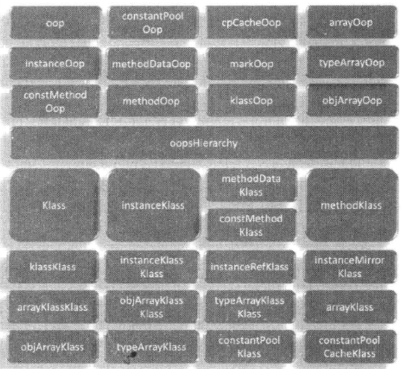
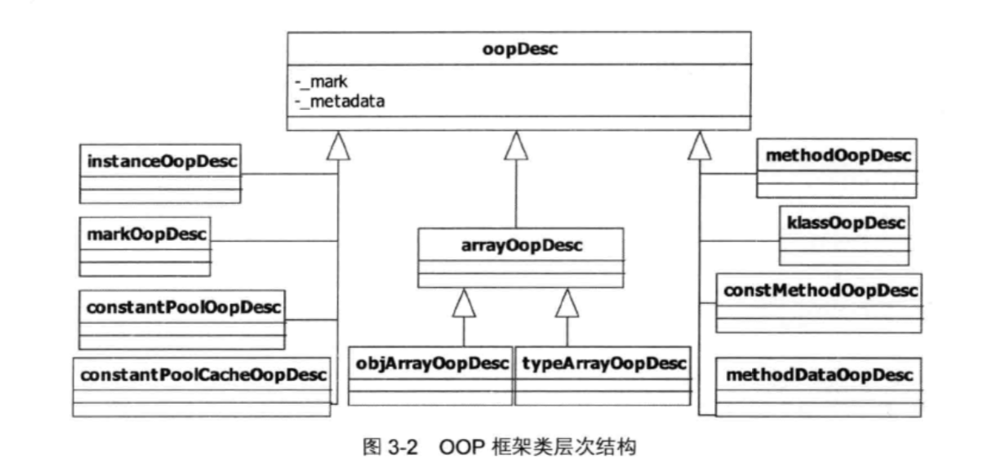
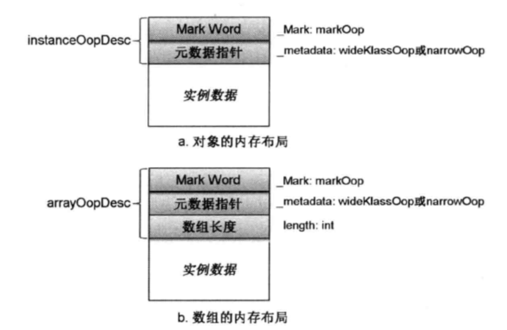
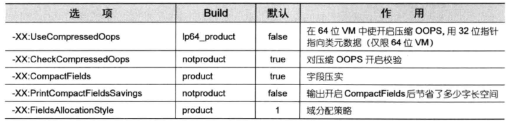
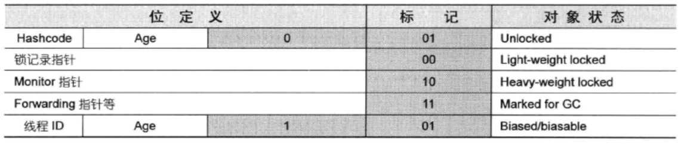

# 1、类与对象

## 1、类与对象的数据结构

在JVM源码中，类与对象的数据结构已C++语言描述是：

OOP：描述实例信息

Klass：描述类信息

具体结构图如下：

### 1、OOP

OOP模块的组成主要是以上部分，在C++中对以上实例组成的抽象描述类是：oopDesc，位于oop.hpp文件中定义.

~~~c++
// Java对象描述，每创建一个Java对象，就有一个OOPDesc，该类是所有Java对象的基类
class oopDesc {
  friend class VMStructs;
 private:
  volatile markOop  _mark;
  union _metadata { // 类元数据指针,用了一个联合表示,64bit下启用压缩为4字节,未启用为8字节（64位CPU指针8字节）
    Klass*      _klass; // 和虚拟机位数相等，32位四字节，64位八字节。
    narrowKlass _compressed_klass; // 压缩过的指针，仅限64位jvm，用32位指针。
  } _metadata;
......
}
~~~

类图如下：

#### 1、组成

每个OOP对象都可以分为三部分：1、对象头  2、元数据指针  3、实例数据

内存布局如下：

**优化点：**

查找实例对应的类对象代码：

~~~c++
// 返回对象对应的类型
inline Klass* oopDesc::klass() const {
    if (UseCompressedClassPointers) { // -XX:UseCompressedOops,64位VM上，对_metaData成员使用32位指针存储
    return Klass::decode_klass_not_null(_metadata._compressed_klass);
  } else {
    return _metadata._klass;
  }
}
~~~

其中元数据指针可以通过-XX:UseCompressedOops配置选项，在64位机器上使用32位元数据指针，该选项可以降低其内存开销。

与之相关的选项还有：

#### 2、MarkWord

可以看出，为了充分利用markword，这里对象在不同状态下表示的数据也不一样。

这里可以对照Object.hashcode方法看一下在对象的不同状态下是如何获得对象的hashcode值的（TODO）。

### 2、Klass

