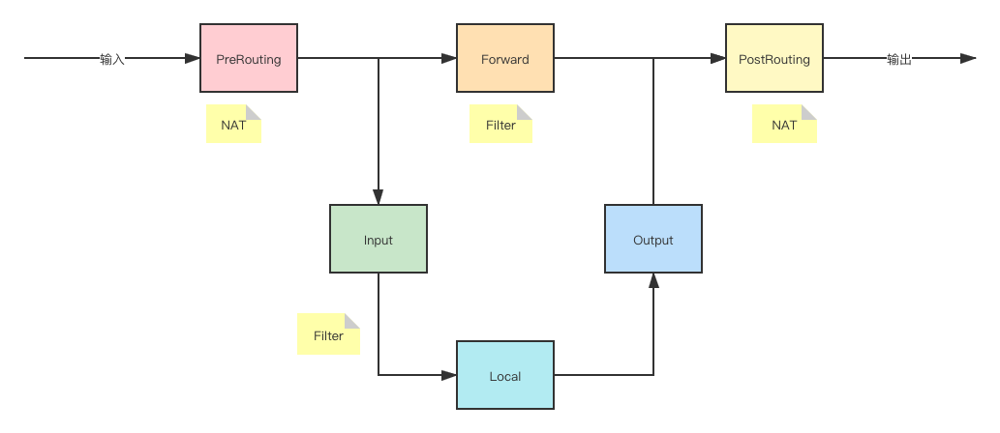

# IPTables

## 1、基本操作

~~~shell
iptables [-t 要操作的表]
         操作命令
         [要操作的链]
         [规则号码]
         [匹配条件]
         [-j 匹配到之后的动作]
~~~

表

- filter
- Nat

链

- Input：位于filter表，匹配目的IP是本机的数据包

- Forward：位于filter表，匹配穿过本机的数据包

- PreRouting：位于nat表，用于修改目的地址（DNAT）

- PostRouting：位于nat表，用于修改源地址（SNAT）

  

操作命令

- A：追加
- I：插入第一条
- D：删除
- F：删除清空表
- R：替换
- P：设置默认规则

动作

- DROP：丢弃
- ACCEPT：接收，默认规则是丢弃
- SNAT：源地址转换
- DNAT：目的地址转换
- MASQUERADE：动态源地址转换

规则

- -s：源地址网段
- -d：目的地址网段
- -i：输入网卡
- -o：输出网卡
- --sport：源地址端口，可指定范围如2100:65535，必须加-p参数
- --dport：目的地址端口，可指定范围如2100:65535，必须加-p参数
- -p：协议，TCP/UDP

动作

## 2、常用命令

~~~shell
# 查看所有规则
iptables -t filter/nat -nvL

~~~

## 3、实用案例

### 1、Linux主机充当网关

1、开启forward，Linux默认是关闭forward流程的（如果/proc/sys/net/ipv4/ip_forward内容是0的话，执行下面的指令）

~~~shell
echo 1 > /proc/sys/net/ipv4/ip_forward
~~~

2、在filter表的Forward链中添加源地址源网卡/目的地址目的网卡的规则（如果Forward有默认的Drop规则的话，删除掉dro规则或者添加下面新的规则）

如：

~~~shell
# 接收两个网卡的输入输出流量
iptables -t filter -A FORWARD -i eth0 -o veth1 -j ACCEPT
iptables -t filter -A FORWARD -o eth0 -i veth1 -j ACCEPT
~~~

3、做源地址转换DNAT（如果是内网地址需要访问外网的话）

~~~shell
# MASQUERADE是动态源地址转换的意思，eth0网卡地址变化的时候，也能正确的进行地址转换
iptables -t nat -A POSTROUTING -s 192.168.45.0/24 -o eth0 -j MASQUERADE
~~~

参考文章：

>https://www.cnblogs.com/sammyliu/p/5760125.html

