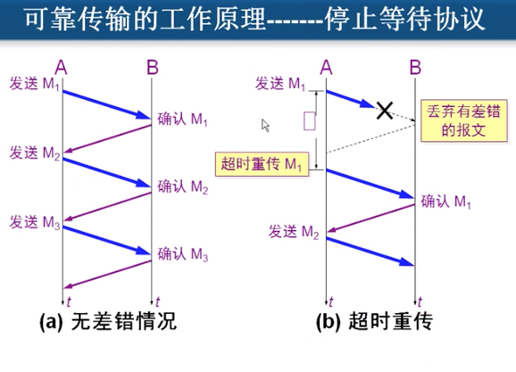
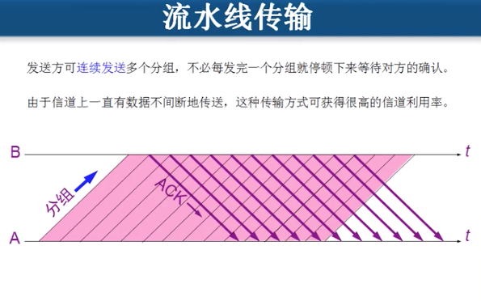
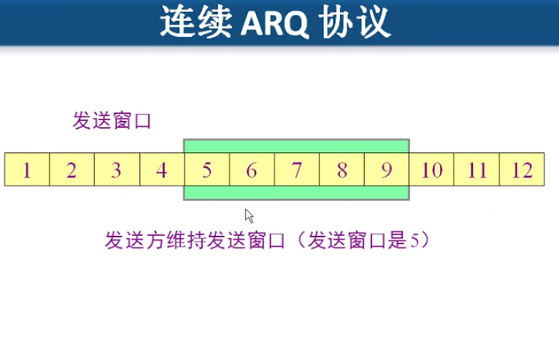
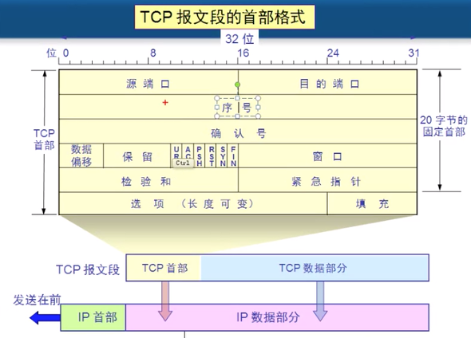
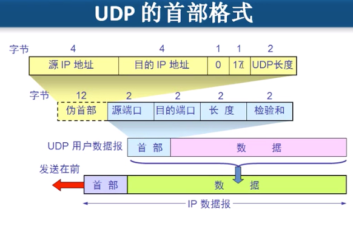

# 传输层

## 1、概述

传输层会对收到的报文进行差错检验；提供面向连接和无连接的服务。

传输层主要要两个协议：TCP和UDP

TCP：传输控制协议

UDP：用户数据报协议

### 1、对比

|      | TCP                                  | UDP                                        |
| ---- | ------------------------------------ | ------------------------------------------ |
| 特点 | 建立会话，可靠传输（分段），流量控制 | 一个数据包，不分段，不建立会话，不可靠传输 |
| 应用 | HTTP协议                             | DNS域名解析                                |
|      |                                      |                                            |
|      |                                      |                                            |

http=tcp+80

https=tcp+443

**提供应用程序之间的逻辑通信**

套接字 = IP地址 + 端口

~~~shell
查看网络连接，地址协议和端口
netstat -n
~~~

## 2、TCP协议

### 1、可靠传输

#### 1、工作原理

停止等待协议

只有在等待到了接收方的确认消息后，才发送下一个数据包。

停止等待协议的确认包可能会丢失或者迟到，此时发送方和接收方都能正常进行处理。

**这种可靠传输协议通常统称为：自动重传请求ARQ**

#### 2、优缺点

优点：简单 

缺点：信道利用率低

#### 3、解决方案

##### 1、流水线传输

流水线传输，直接发送所有的数据包，不等待接收确认消息。

##### 2、保证可靠性

使用连续ARQ协议（滑动窗口）

发送方维护一个窗口，发送窗口中的所有数据包，直到窗口最左边的数据包接收到确认后，就移动窗口，继续发送。

累计确认：接收方收到多个连续的数据后，像发送方确认收到了多个数据包，让发送方继续发送接下来的数据包。

### 2、报文格式

序号：该段在整个数据中的偏移量

确认号：下一个要发送的数据的偏移

数据偏移：用于计算数据在TCP报文段中的偏移，三bit最大15，每个表示4字节

URG：中断发送，不需要排队

ACK：该位为1，确认号才有用

SYN：建立请求，发起会话的数据包；建立会话后，SYN会置为0

FIN：final，数据发送完毕，需要释放连接

PSH：push

RST：restart

窗口：TCP缓存的大小，在建立连接的时候，双方会将自己能接收最大数据包的大小和窗口缓存大小告诉对方。

校验和：验证数据完整性

紧急指针：

### 3、滑动窗口

滑动窗口有两个属性：1、接收和发送缓冲区大小。2、窗口大小

### 4、流量控制

rwnd在传输过程中动态设置滑动窗口的大小，用于进行流量控制

### 5、三次握手

### 6、四次挥手

## 3、UDP协议

