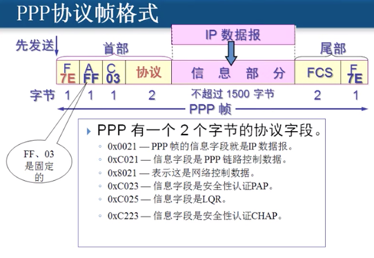

# 数据链路层

## 1、帧

### 1、封装成帧

在一段数据的前后添加首部和尾部就构成了一个帧（开始和结束标记字符）

**在物理层，传输的是一个个的bit，而在数据链路层，使用的基本单位是帧**

### 2、透明传输

传送的数据中出现的表示帧开始和结束的字符

解决方法：**字节填充**（类似于字符串中的转义）

即在数据中出现了开始和结束字符的前面添加一个转义字符（例如Esc，十六进制为1B），数据中出现转义字符的前面在再添加一个转义字符。

## 2、差错检测

### 1、问题

数据在传输过程中，0变成了1或者1变成了0，产生了**比特差错**

出错比特数占传输总比特数的比例称为**误码率**

**传输层实现可靠传输，数据链路层只负责无差错接收**

### 2、循环冗余检验（CRC）

1、除数比补的零多一位，除数随便取

2、运算完之后，会将余数（FCS，冗余码）补到数据中

传输数据为：101001经过CRC后传输数据就为：101001001

3、接收方在接收到数据后，也进行此算法，如果余数为0就表示正确传输并接收到了数据，如果为1，就丢弃数据。

4、使用不进位加法运算

**错误并不一定都能检测出来，但是如果除数够长，可以降低检测不出的概率**

## 3、PPP协议

即点对点协议，使用电话线拨号都是使用的该协议，是广域网上两台路由器之间数据链路层间通信的协议

可以在该协议上使用多种网络层协议

A和C字段是固定格式，字节填充使用5E和5D

零比特填充：出现五个连续的1，插入一个0

## 4、CSMA/CD

即局域网之间数据链路层所使用的协议，广播信道

使用该协议无法进行全双工通信，只能进行半双工通信

## 5、以太网

满足802.3标准的局域网，或者说满足CSMA/CD的都是以太网

## 6、Mac层

在数据链路层又一个Mac层，Mac地址在计算机网络配置中可以修改

## 7、交换机

交换机的前身是网桥，且有一个Mac地址表存放对于网口的机器的Mac地址。

网络中有数据通过时，交换机会记录对于网口机器的Mac，这是通过获取数据链路层Mac层帧信息中的源Mac地址和目标Mac地址来进行保存和映射的。