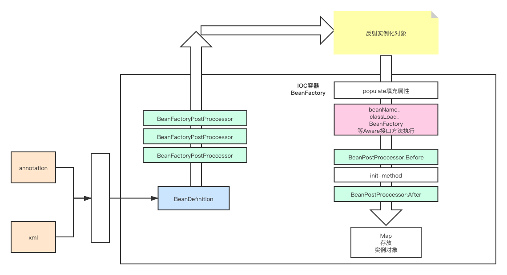

# 1、SpringIOC

## 1、IOC容器的流程

## 2、Bean的生命周期

主要方法：doCreateBean

简单流程说明：根据IOC容器初始化得到的BeanDefinition对象

1、先进行反射得到java对象

2、然后进行populate填充属性（在这里处理dependson和自动注入）

3、执行bean处理器的before方法，这里还会执行spring内部的一些前置处理器，比如ApplicationContextAware接口的实现。

4、执行bean的init-method方法

5、然后执行bean后置处理器的after方法，这里还会执行spring内部的一些后置处理器，比如aop和事务的后置处理器。

